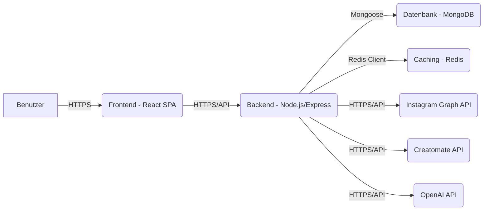
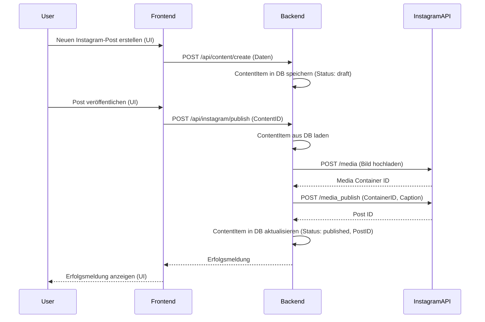
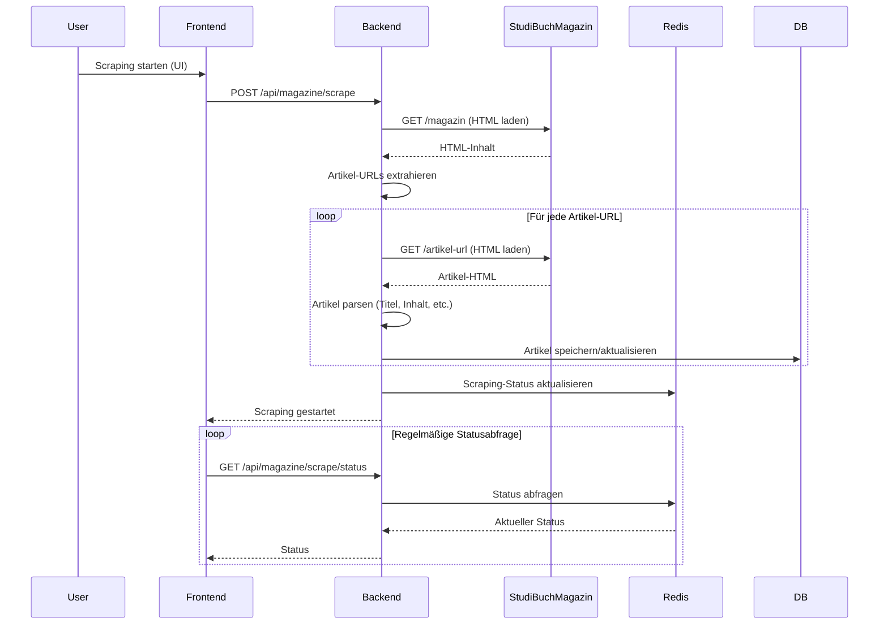

# StudiFlow AI Enterprise - Technische Dokumentation (Erweitert)

## Übersicht

StudiFlow AI Enterprise ist eine integrierte Lösung für Content-Management und Social Media Automatisierung, die speziell für StudiBuch entwickelt wurde. Das System ermöglicht die nahtlose Integration mit Instagram, automatisches Scraping von Magazin-Artikeln, Vorschau von Content und automatische Generierung von Reels.

Diese erweiterte Dokumentation beschreibt detailliert die technische Architektur, Komponenten, Datenflüsse, API-Endpunkte, Installations- und Konfigurationsanweisungen, Sicherheits- und Datenschutzkonzepte sowie Anleitungen zur Wartung und Erweiterung des Systems.

## Inhaltsverzeichnis

1. [Systemarchitektur](#systemarchitektur)
   - [Überblick](#überblick)
   - [Architekturdiagramm](#architekturdiagramm)
   - [Technologie-Stack](#technologie-stack)
   - [Datenflussdiagramme](#datenflussdiagramme)
2. [Komponenten](#komponenten)
   - [Frontend](#frontend)
   - [Backend](#backend)
   - [Service-Module (Detailliert)](#service-module-detailliert)
   - [Datenbank](#datenbank)
3. [Datenmodelle](#datenmodelle)
   - [User](#user)
   - [InstagramAccount](#instagramaccount)
   - [ContentItem](#contentitem)
   - [MagazineArticle](#magazinearticle)
   - [ReelTemplate](#reeltemplate)
4. [API-Dokumentation](#api-dokumentation)
   - [Authentifizierung](#authentifizierung)
   - [Instagram](#instagram)
   - [Magazin](#magazin)
   - [Content](#content)
   - [Creatomate](#creatomate)
   - [KI](#ki)
   - [Statistiken](#statistiken)
   - [Aktivitäten](#aktivitäten)
   - [Benutzer](#benutzer)
   - [API-Beispiele (cURL)](#api-beispiele-curl)
5. [Installation und Konfiguration](#installation-und-konfiguration)
   - [Voraussetzungen](#voraussetzungen)
   - [Installation (Schritt-für-Schritt)](#installation-schritt-für-schritt)
   - [Konfiguration (Umgebungsvariablen)](#konfiguration-umgebungsvariablen)
   - [Datenbank-Setup](#datenbank-setup)
   - [Starten der Anwendung](#starten-der-anwendung)
   - [Deployment-Strategien](#deployment-strategien)
6. [Entwicklung und Erweiterung](#entwicklung-und-erweiterung)
   - [Entwicklungsumgebung einrichten](#entwicklungsumgebung-einrichten)
   - [Coding-Standards](#coding-standards)
   - [Tests ausführen](#tests-ausführen)
   - [Build erstellen](#build-erstellen)
   - [Neue Service-Module hinzufügen](#neue-service-module-hinzufügen)
   - [Neue API-Endpunkte hinzufügen](#neue-api-endpunkte-hinzufügen)
   - [Frontend-Komponenten erweitern](#frontend-komponenten-erweitern)
7. [Sicherheit](#sicherheit)
   - [Sicherheitskonzept](#sicherheitskonzept)
   - [Authentifizierung und Autorisierung](#authentifizierung-und-autorisierung-1)
   - [API-Sicherheit (inkl. Rate Limiting)](#api-sicherheit-inkl-rate-limiting)
   - [Datensicherheit](#datensicherheit)
   - [Konfigurationssicherheit](#konfigurationssicherheit)
   - [Empfohlene Maßnahmen](#empfohlene-maßnahmen)
8. [Datenschutz](#datenschutz)
   - [Datenschutzkonzept](#datenschutzkonzept)
   - [DSGVO-Konformität](#dsgvo-konformität)
   - [Datenerfassung und -verarbeitung](#datenerfassung-und-verarbeitung)
   - [Einwilligungsmechanismen](#einwilligungsmechanismen-1)
   - [Betroffenenrechte](#betroffenenrechte)
   - [Drittanbieter-Integrationen](#drittanbieter-integrationen)
   - [Empfohlene Maßnahmen](#empfohlene-maßnahmen-1)
9. [Wartung und Betrieb](#wartung-und-betrieb)
   - [Logging](#logging)
   - [Monitoring](#monitoring)
   - [Backup und Wiederherstellung](#backup-und-wiederherstellung)
   - [Fehlerbehebung (Troubleshooting)](#fehlerbehebung-troubleshooting)
10. [Bekannte Probleme und Einschränkungen](#bekannte-probleme-und-einschränkungen)
11. [Glossar](#glossar)

---

## 1. Systemarchitektur

### Überblick

StudiFlow AI Enterprise basiert auf einer modernen, modularen Architektur mit klarer Trennung von Frontend und Backend. Die Hauptkomponenten sind:

1.  **Frontend**: React-basierte Single-Page-Application (SPA)
2.  **Backend**: Node.js-Server mit Express
3.  **Datenbank**: MongoDB für persistente Datenspeicherung
4.  **Externe API-Integrationen**: Instagram Graph API, Creatomate API, OpenAI API
5.  **Caching**: Redis für Rate Limiting und Caching von Magazin-Artikeln

### Architekturdiagramm



### Technologie-Stack

-   **Frontend**: React, TypeScript, Material UI (MUI), Axios
-   **Backend**: Node.js, Express, TypeScript, Mongoose, Winston (Logging), Redis
-   **Datenbank**: MongoDB
-   **Caching**: Redis
-   **Testing**: Jest, Selenium WebDriver, Supertest
-   **Deployment**: Docker (optional), PM2

### Datenflussdiagramme

#### Beispiel: Content-Veröffentlichung auf Instagram



#### Beispiel: Magazin-Scraping



---

## 2. Komponenten

### Frontend

Das Frontend ist eine React-basierte Single-Page-Application (SPA), die mit TypeScript entwickelt wurde. Es verwendet Material UI (MUI) für die UI-Komponenten und Axios für die Kommunikation mit dem Backend.

-   **Struktur**: Das Frontend ist in Komponenten, Seiten, Services und Utilities unterteilt.
-   **State Management**: React Context API oder eine dedizierte State-Management-Bibliothek (z.B. Zustand, Redux) kann verwendet werden.
-   **Routing**: React Router DOM für die Navigation zwischen den Seiten.

### Backend

Das Backend ist ein Node.js-Server, der mit Express und TypeScript entwickelt wurde. Es stellt eine RESTful API für das Frontend bereit und kommuniziert mit der Datenbank und externen APIs.

-   **Struktur**: Das Backend ist in Router, Controller, Services, Middleware und Models unterteilt.
-   **Middleware**: Wichtige Middleware umfasst Authentifizierung (JWT), Rate Limiting, Logging und Fehlerbehandlung.
-   **Asynchrone Aufgaben**: Für langlaufende Aufgaben wie Scraping oder Reel-Generierung können Job-Queues (z.B. BullMQ) verwendet werden.

### Service-Module (Detailliert)

Die Service-Module kapseln die Kernlogik der Anwendung:

-   **`instagram`**: Kommunikation mit der Instagram Graph API (Authentifizierung, Content-Veröffentlichung, Insights).
-   **`magazine`**: Scraping, Parsing und Verwaltung von StudiBuch-Magazin-Artikeln.
-   **`content`**: Erstellung, Verwaltung, Planung und Vorschau von Social-Media-Inhalten.
-   **`creatomate`**: Kommunikation mit der Creatomate API zur Generierung von Reels und Videos.
-   **`ai`**: Integration mit KI-Diensten (OpenAI, Gemini) zur Textgenerierung, Hashtag-Vorschlägen etc.
-   **`user`**: Benutzerverwaltung, Authentifizierung und Autorisierung.
-   **`ankauf`**: Logik für das integrierte Ankaufsystem (Beta).
-   **`scheduler`**: Planung und Ausführung von wiederkehrenden Aufgaben (z.B. geplante Posts, Scraping).

### Datenbank

MongoDB wird als primäre Datenbank verwendet. Mongoose dient als ODM (Object Data Modeling) Bibliothek zur Interaktion mit MongoDB.

-   **Schema-Design**: Die Datenmodelle (siehe Abschnitt 3) definieren die Struktur der MongoDB-Collections.
-   **Indizes**: Wichtige Felder (z.B. `userId`, `accountId`, `status`) sind indiziert, um die Abfrageleistung zu optimieren.

---

## 3. Datenmodelle

*(Die Datenmodelle sind bereits in der vorherigen Version enthalten und bleiben unverändert. Hier könnten bei Bedarf detailliertere Erklärungen zu den Feldern hinzugefügt werden.)*

---

## 4. API-Dokumentation

*(Die API-Endpunkte sind bereits aufgelistet. Hier werden nun Beispiele hinzugefügt.)*

### API-Beispiele (cURL)

**Benutzeranmeldung:**
```bash
curl -X POST http://localhost:3000/api/auth/login \
     -H "Content-Type: application/json" \
     -d 
```

**Content-Item erstellen (mit Token):**
```bash
curl -X POST http://localhost:3000/api/content/create \
     -H "Authorization: Bearer YOUR_JWT_TOKEN" \
     -H "Content-Type: application/json" \
     -d 
```

**Magazin-Artikel abrufen (mit Token):**
```bash
curl -X GET http://localhost:3000/api/magazine/articles \
     -H "Authorization: Bearer YOUR_JWT_TOKEN"
```

*(Weitere Beispiele für jeden Endpunkt könnten hier hinzugefügt werden.)*

---

## 5. Installation und Konfiguration

### Voraussetzungen

-   Node.js (v16 oder höher empfohlen)
-   MongoDB (v4 oder höher)
-   Redis (v6 oder höher)
-   npm (v7 oder höher) oder yarn
-   Git

### Installation (Schritt-für-Schritt)

1.  **Repository klonen**: `git clone <repository_url> && cd studiflow-ai-enterprise`
2.  **Abhängigkeiten installieren**: `npm install` (oder `yarn install`)
3.  **MongoDB starten**: Stellen Sie sicher, dass Ihr MongoDB-Server läuft.
4.  **Redis starten**: Stellen Sie sicher, dass Ihr Redis-Server läuft.
5.  **Umgebungsvariablen konfigurieren**: Erstellen Sie eine `.env`-Datei im Stammverzeichnis (siehe unten).
6.  **Datenbank initialisieren** (optional, falls Seeds vorhanden): `npm run seed`
7.  **Anwendung starten**: `npm run dev` (Entwicklung) oder nach `npm run build` mit `npm start` (Produktion)

### Konfiguration (Umgebungsvariablen)

Erstellen Sie eine `.env`-Datei im Stammverzeichnis:

```dotenv
# Server Konfiguration
PORT=3000
NODE_ENV=development # oder production
APP_BASE_URL=http://localhost:3000

# Datenbank Konfiguration
MONGODB_URI=mongodb://localhost:27017/studiflow

# Redis Konfiguration
REDIS_HOST=localhost
REDIS_PORT=6379
# REDIS_PASSWORD=your_redis_password (optional)

# JWT Konfiguration
JWT_SECRET=your_very_strong_secret_key_please_change_me
JWT_EXPIRY=1h # z.B. 1h, 7d

# Instagram API Konfiguration
INSTAGRAM_APP_ID=your_instagram_app_id
INSTAGRAM_APP_SECRET=your_instagram_app_secret
INSTAGRAM_REDIRECT_URI=${APP_BASE_URL}/api/auth/instagram/callback

# Creatomate API Konfiguration
CREATOMATE_API_KEY=your_creatomate_api_key

# OpenAI API Konfiguration
OPENAI_API_KEY=your_openai_api_key

# Logging Konfiguration
LOG_LEVEL=info # debug, info, warn, error
```

### Datenbank-Setup

-   Stellen Sie sicher, dass MongoDB läuft und über die in `MONGODB_URI` angegebene Adresse erreichbar ist.
-   Die Anwendung erstellt die notwendigen Collections automatisch beim ersten Start, wenn sie nicht existieren.

### Starten der Anwendung

-   **Entwicklung**: `npm run dev` (TypeScript via ts-node)
-   **Produktion**: `npm run build && npm start`
-   **Produktion mit PM2**: `npm run build && pm2 start dist/index.js --name studiflow`

### Deployment-Strategien

-   **Manuell**: Code auf den Server kopieren, Abhängigkeiten installieren, `.env` konfigurieren, mit `npm start` oder PM2 starten.
-   **Docker**: Verwenden Sie das bereitgestellte `Dockerfile` und `docker-compose.yml`, um die Anwendung und ihre Abhängigkeiten (MongoDB, Redis) in Containern zu betreiben.
    ```bash
    docker-compose up -d --build
    ```
-   **CI/CD**: Richten Sie eine CI/CD-Pipeline (z.B. mit GitHub Actions, GitLab CI) ein, um Tests, Builds und Deployments zu automatisieren.

---

## 6. Entwicklung und Erweiterung

### Entwicklungsumgebung einrichten

-   Installieren Sie die Voraussetzungen (Node.js, MongoDB, Redis, Git).
-   Klonen Sie das Repository.
-   Installieren Sie die Abhängigkeiten (`npm install`).
-   Konfigurieren Sie die `.env`-Datei für die Entwicklung.
-   Starten Sie die Anwendung im Entwicklungsmodus (`npm run dev`).

### Coding-Standards

-   **Sprache**: TypeScript
-   **Linter**: ESLint (Konfiguration in `.eslintrc.js`)
-   **Formatter**: Prettier (Konfiguration in `.prettierrc.js`)
-   **Namenskonventionen**: camelCase für Variablen und Funktionen, PascalCase für Klassen und Interfaces.
-   **Kommentare**: JSDoc für Funktionen und Klassen.

### Tests ausführen

-   **Unit-Tests**: `npm run test:unit`
-   **Integrationstests**: `npm run test:integration`
-   **End-to-End-Tests**: `npm run test:e2e` (erfordert Selenium WebDriver)
-   **Alle Tests**: `npm test`
-   **Test-Coverage**: `npm run coverage`

### Build erstellen

-   Führen Sie `npm run build` aus. Der kompilierte JavaScript-Code wird im `dist`-Verzeichnis abgelegt.

### Neue Service-Module hinzufügen

1.  Erstellen Sie eine neue Datei im Verzeichnis `src/services` (z.B. `src/services/neuer-service.ts`).
2.  Implementieren Sie die Service-Logik als Klasse oder Objekt.
3.  Exportieren Sie den Service.
4.  Importieren und verwenden Sie den Service in Controllern oder anderen Services.

### Neue API-Endpunkte hinzufügen

1.  Erstellen Sie eine neue Router-Datei im Verzeichnis `src/api` (z.B. `src/api/neue-route.ts`).
2.  Definieren Sie die Routen mit Express Router.
3.  Implementieren Sie die Controller-Logik (entweder direkt im Router oder in separaten Controller-Dateien).
4.  Fügen Sie notwendige Middleware hinzu (z.B. `authenticateToken`, `rateLimiter`).
5.  Registrieren Sie den neuen Router in `src/api/index.ts`.

### Frontend-Komponenten erweitern

1.  Erstellen Sie neue React-Komponenten im Verzeichnis `src/ui/components` oder `src/ui/pages`.
2.  Verwenden Sie Material UI (MUI) für konsistentes Styling.
3.  Nutzen Sie den API-Client (`src/services/api.ts`) für die Kommunikation mit dem Backend.
4.  Fügen Sie neue Routen in `src/App.tsx` hinzu.

---

## 7. Sicherheit

### Sicherheitskonzept

Das Sicherheitskonzept basiert auf mehreren Ebenen:

-   **Authentifizierung**: Sicherstellung, dass nur legitime Benutzer auf das System zugreifen können (JWT).
-   **Autorisierung**: Sicherstellung, dass Benutzer nur auf die Ressourcen zugreifen können, für die sie berechtigt sind (Rollenbasiert).
-   **API-Sicherheit**: Schutz der API vor Angriffen (Rate Limiting, Input Validation).
-   **Datensicherheit**: Schutz der gespeicherten Daten (Hashing, Verschlüsselung empfohlen).
-   **Transportsicherheit**: Verschlüsselung der Kommunikation (HTTPS).
-   **Konfigurationssicherheit**: Sicherer Umgang mit sensiblen Konfigurationsdaten (Umgebungsvariablen).

### Authentifizierung und Autorisierung

-   **JWT**: JSON Web Tokens werden für die Sitzungsverwaltung verwendet. Tokens werden bei der Anmeldung generiert und müssen bei jeder API-Anfrage im `Authorization`-Header gesendet werden.
-   **Passwort-Hashing**: Passwörter werden mit `bcrypt` sicher gehasht.
-   **Rollen**: Das System unterstützt die Rollen `admin`, `editor`, `viewer`. Der Zugriff auf bestimmte API-Endpunkte und UI-Bereiche wird basierend auf der Rolle eingeschränkt.

### API-Sicherheit (inkl. Rate Limiting)

-   **Rate Limiting**: Die Middleware `src/middleware/rate-limiter.ts` schützt vor Brute-Force- und DoS-Angriffen. Es gibt spezifische Limits für verschiedene Endpunkte (Allgemein, Auth, Instagram, Creatomate, AI).
-   **Input Validation**: Express-Validator oder eine ähnliche Bibliothek sollte verwendet werden, um alle Eingaben zu validieren und zu bereinigen.
-   **HTTPS**: Die gesamte API-Kommunikation sollte über HTTPS erfolgen.
-   **CORS**: Cross-Origin Resource Sharing ist konfiguriert, um Anfragen nur von erlaubten Frontend-Domains zuzulassen.

### Datensicherheit

-   **Passwörter**: Sicher gehasht mit bcrypt.
-   **API-Schlüssel**: Werden derzeit im Klartext gespeichert. **Empfehlung**: Verschlüsselung implementieren (z.B. mit `crypto` Modul von Node.js).
-   **Datenbankzugriff**: Der Zugriff auf die MongoDB sollte durch Benutzername/Passwort und IP-Whitelisting gesichert werden.

### Konfigurationssicherheit

-   **Umgebungsvariablen**: Sensible Daten (API-Schlüssel, JWT-Secret, DB-URI) werden ausschließlich über Umgebungsvariablen (`.env`-Datei) verwaltet und nicht im Code gespeichert.
-   **Fehlermeldungen**: Im Produktionsmodus sollten generische Fehlermeldungen verwendet werden, um keine internen Details preiszugeben.

### Empfohlene Maßnahmen

1.  **Datenverschlüsselung**: Sensible Daten (API-Schlüssel) in der Datenbank verschlüsseln.
2.  **Input Validation**: Konsequente Validierung aller API-Eingaben implementieren.
3.  **Security Headers**: Hinzufügen von Security Headers (CSP, HSTS, X-Frame-Options etc.) zur Express-Anwendung.
4.  **Abhängigkeitsprüfung**: Regelmäßige Überprüfung der Abhängigkeiten auf bekannte Schwachstellen (z.B. mit `npm audit`).
5.  **Regelmäßige Audits**: Durchführung regelmäßiger Sicherheitsaudits.

---

## 8. Datenschutz

### Datenschutzkonzept

Das Datenschutzkonzept zielt darauf ab, die Anforderungen der DSGVO zu erfüllen:

-   **Transparenz**: Klare Information über die Datenverarbeitung.
-   **Einwilligung**: Einholung einer gültigen Einwilligung für die Datenverarbeitung.
-   **Datenminimierung**: Erfassung nur notwendiger Daten.
-   **Zweckbindung**: Verarbeitung nur für festgelegte Zwecke.
-   **Speicherbegrenzung**: Löschung von Daten, wenn sie nicht mehr benötigt werden.
-   **Integrität und Vertraulichkeit**: Schutz der Daten vor unbefugtem Zugriff.
-   **Rechenschaftspflicht**: Nachweis der Einhaltung der Datenschutzgrundsätze.

### DSGVO-Konformität

**Aktueller Stand**: Das System weist Mängel in der DSGVO-Konformität auf.
**Empfehlungen**: Siehe Abschnitt "Empfohlene Maßnahmen".

### Datenerfassung und -verarbeitung

-   **Erfasste Daten**: Benutzerdaten (Name, E-Mail, Passwort-Hash, Rolle), Instagram-Kontodaten (Token, Profilinfos), Content-Daten, Magazin-Artikel, Aktivitätslogs, IP-Adressen.
-   **Zwecke**: Benutzerauthentifizierung, Systembetrieb, Instagram-Interaktion, Content-Management, Reel-Generierung, Fehleranalyse.
-   **Rechtsgrundlage**: Muss klar definiert werden (z.B. Vertragserfüllung, Einwilligung, berechtigtes Interesse).

### Einwilligungsmechanismen

-   **Aktueller Stand**: Fehlend.
-   **Empfehlung**: Implementierung eines Checkbox-basierten Einwilligungsmechanismus bei der Registrierung und bei der Verbindung von Drittanbieter-Konten. Möglichkeit zum Widerruf der Einwilligung in den Benutzereinstellungen.

### Betroffenenrechte

-   **Aktueller Stand**: Teilweise implementiert (Profilbearbeitung), aber Mechanismen für Auskunft, Löschung und Datenübertragbarkeit fehlen.
-   **Empfehlung**: Implementierung von Funktionen in den Benutzereinstellungen, um Auskunft anzufordern, Daten zu exportieren und das Konto zu löschen. Erstellung eines internen Prozesses zur Bearbeitung dieser Anfragen.

### Drittanbieter-Integrationen

-   **Instagram, Creatomate, OpenAI**: Bei der Verbindung dieser Dienste werden Daten an die Anbieter übertragen. Benutzer müssen darüber informiert werden und zustimmen.
-   **Empfehlung**: Klare Hinweise und Links zu den Datenschutzerklärungen der Drittanbieter im Verbindungsprozess. Einholung einer separaten Einwilligung.

### Empfohlene Maßnahmen

1.  **Datenschutzerklärung**: Erstellung und Integration einer umfassenden, verständlichen Datenschutzerklärung.
2.  **Einwilligungsmanagement**: Implementierung eines robusten Einwilligungsmechanismus (Opt-in, Widerruf).
3.  **Betroffenenrechte**: Implementierung von Funktionen zur Ausübung der Rechte auf Auskunft, Berichtigung, Löschung und Datenübertragbarkeit.
4.  **Verzeichnis von Verarbeitungstätigkeiten**: Erstellung und Pflege eines Verzeichnisses aller Verarbeitungstätigkeiten.
5.  **Datenschutz-Folgenabschätzung (DSFA)**: Durchführung einer DSFA, falls risikoreiche Verarbeitungen stattfinden.
6.  **Auftragsverarbeitungsverträge (AVV)**: Abschluss von AVVs mit allen Drittanbietern, die personenbezogene Daten im Auftrag verarbeiten.

---

## 9. Wartung und Betrieb

### Logging

-   **Tool**: Winston
-   **Level**: Konfigurierbar über `LOG_LEVEL` (default: `info`).
-   **Dateien**: `error.log`, `combined.log`.
-   **Format**: JSON für einfache Verarbeitung durch Log-Management-Systeme.

### Monitoring

-   **Empfehlung**: Einsatz von Tools wie PM2 (`pm2 monit`), Prometheus & Grafana, Datadog oder New Relic zur Überwachung von:
    -   Server-Auslastung (CPU, RAM, Netzwerk)
    -   Anwendungs-Performance (Antwortzeiten, Fehlerraten)
    -   Datenbank-Performance
    -   Redis-Performance
-   **Health Check**: Der Endpunkt `/api/health` gibt den Systemstatus zurück.

### Backup und Wiederherstellung

-   **MongoDB**: Regelmäßige Backups mit `mongodump`. Testen Sie den Wiederherstellungsprozess mit `mongorestore`.
-   **Redis**: Redis kann für Persistenz konfiguriert werden (RDB Snapshots, AOF). Regelmäßige Backups der Persistenzdateien.
-   **Dateisystem**: Sichern Sie den Quellcode und die Konfigurationsdateien (`.env`).

### Fehlerbehebung (Troubleshooting)

-   **Logs prüfen**: Analysieren Sie `error.log` und `combined.log` auf Fehlermeldungen.
-   **Health Check**: Überprüfen Sie den `/api/health` Endpunkt.
-   **Abhängigkeiten**: Stellen Sie sicher, dass MongoDB und Redis laufen und erreichbar sind.
-   **Umgebungsvariablen**: Überprüfen Sie die Korrektheit der `.env`-Datei.
-   **Netzwerk**: Prüfen Sie Netzwerkverbindungen zu externen APIs.
-   **Entwicklertools**: Nutzen Sie die Browser-Entwicklertools (Netzwerk-Tab, Konsole) zur Frontend-Fehleranalyse.

---

## 10. Bekannte Probleme und Einschränkungen

*(Diese Sektion sollte basierend auf den Ergebnissen des Sicherheitsaudits und der Datenschutzvalidierung aktualisiert werden, sobald die empfohlenen Maßnahmen umgesetzt wurden. Aktuell sind die Punkte aus der vorherigen Version noch gültig.)*

1.  **Rate Limiting**: Implementiert, aber Feinabstimmung der Limits könnte notwendig sein.
2.  **Datenverschlüsselung**: Sensible Daten (API-Schlüssel) werden nicht verschlüsselt gespeichert (Empfehlung zur Umsetzung).
3.  **Datenschutz**: DSGVO-Konformität noch nicht vollständig erreicht (Empfehlungen zur Umsetzung).
4.  **Fehlerbehandlung**: Generische Fehlermeldungen im Produktionsmodus empfohlen.

---

## 11. Glossar

-   **API**: Application Programming Interface
-   **CRUD**: Create, Read, Update, Delete
-   **CSRF**: Cross-Site Request Forgery
-   **DSGVO**: Datenschutz-Grundverordnung
-   **JWT**: JSON Web Token
-   **MERN**: MongoDB, Express, React, Node.js
-   **MUI**: Material UI (React UI Library)
-   **OAuth**: Open Authorization
-   **ODM**: Object Data Modeling (z.B. Mongoose)
-   **ORM**: Object-Relational Mapping
-   **REST**: Representational State Transfer
-   **SPA**: Single-Page Application
-   **XSS**: Cross-Site Scripting

---

*Ende der erweiterten technischen Dokumentation.*
